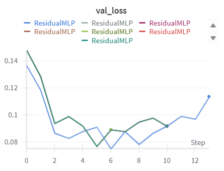

# **Deep Learning Applications - Laboratory 1**

## **Overview**

This laboratory explores the implementation and comparison of different neural network architectures, ranging from simple MLPs to more complex CNNs with residual connections, using PyTorch. The main focus is to investigate the benefits of **residual connections** and **fine-tuning techniques** on model performance.

## **Training Pipeline and Infrastructure**

A **custom training pipeline** was developed to ensure modularity, flexibility, and robust performance monitoring.  
The system integrates seamlessly with **Weights & Biases (WandB)** for real-time experiment tracking, enabling comprehensive analysis of loss and accuracy curves.

## **Key Components**

### **Model Implementation**

- Implemented modular network classes for MLPs and CNNs with residual connections.  
- Architectures designed to be easily extensible for further experiments.

### **Data Management**

- Automated loading and preprocessing of datasets (**MNIST/CIFAR-10/CIFAR-100**).  
- Split into *training, validation, and test sets* to ensure fair evaluation.

### **Custom Training Loop**

The ***train_model*** function handles:  
- Training and validation per epoch.  
- Automatic device detection (GPU if available).  
- **Two Early Stopping Criteria**:  
  1. **Stagnation-based**: stops training when `validation loss` shows no significant improvement for a fixed number of epochs (`patience` + `min_delta`).  
  2. **Overfitting-based**: stops training if `validation loss` increases beyond a threshold  for several consecutive epochs (`overfit_patience`).  
- **Best model saving** (`best_model.pth`) whenever validation loss improves.  
- **Logging to WandB**:  ` loss`, `accuracy` for trainig and validation dataset; Detailed console feedback per epoch.

### **Evaluation Function**

The `evaluate` function provides:  Average loss, Accuracy, Precision (weighted across classes). This ensures a **multi-metric evaluation** beyond simple accuracy, useful for imbalanced datasets.

## **Experiment Monitoring**

WandB was used for: Real-time tracking of training and validation metrics; Visualization of loss/accuracy trends; Comparison between different model architectures.

## **Exercises**

### **Exercise 1:  MLP with Two Hidden Layers on MNIST**

This first exercise introduces a baseline model for handwritten digit classification on the MNIST dataset: a Multilayer Perceptron (MLP) with **two hidden layers**.  The aim is to establish a solid reference point for later comparisons with deeper and more complex architectures, in line with the experimental spirit of the ResNet paper.

**Model Description**  
The network consists of:  
Input Layer: Flattened 28×28 images (784 features)  
Hidden Layer 1: 128 neurons, ReLU activation  
Hidden Layer 2: 64 neurons, ReLU activation  
Dropout: 20% applied after the second hidden layer to reduce overfitting  
Output Layer: 10 neurons (one for each digit class)

This results in the architecture:  
`784 → 128 → 64 → Dropout(0.2) → 10`

The implementation is fully contained within the project’s codebase, and uses a modular design to facilitate modifications.  
The model was trained using a custom training loop that supports:  Stratified dataset split: 90% training, 10% validation; Maximum epochs: 50; Batch size: 128; Optimizer: Adam (learning rate = 1e-3); Loss function: CrossEntropyLoss; Early stopping based on stagnation and overfitting detection

The training converged in fewer than the maximum allowed epochs thanks to early stopping.  
On the test set, the model achieved:  
Test Loss: 0.1053  
Test Accuracy: 97.39%  
Test Precision (weighted): 97.43%

Below are the metrics tracked with Weights & Biases (WandB):

| Training Loss | Validation Loss |
|:-------------:|:---------------:|
|  |  |

| Learning Curve |
|:--------------:|
|  |

---

### **Exercise 1.2  Adding Residual Connections to the MLP**

In this exercise, the baseline MLP from *Exercise 1* was extended to include residual connections, following the principles introduced in the ResNet paper.  The goal was to investigate whether adding skip connections improves the trainability of deeper fully connected networks, both in terms of convergence speed and final accuracy.

**Model Description**  
The model consists of:  
Input Layer: Flattened 28×28 images (784 features)  
First Fully Connected Layer: Projects the input to the hidden representation (110 neurons, ReLU activation)  
Residual Blocks: Each block contains two linear layers with ReLU activations and dropout applied after the second layer. The block output is summed with its input (skip connection), followed by a ReLU activation. For this experiment, 2 residual blocks were stacked sequentially,  Output Layer: Fully connected layer mapping to the 10 digit classes.

Architecture:  
`784 → FC(110) → [ResidualBlock × 2] → FC(10)`

The training setup is the same as the previous exercise.

**Comparison MLP vs ResidualMLP**  
Residual connections provided faster convergence (training stopped at epoch 11 vs 17 for the plain MLP) and slightly better performance on the test set.

| Model         | Epochs | Test Loss | Test Accuracy | Test Precision (weighted) |
|---------------|--------|-----------|---------------|---------------------------|
| MLP           | 17     | 0.1053    | 97.39%        | 97.43%                    |
| ResidualMLP   | **11** | 0.0975    | 97.73%        | 97.75%                    |

**Gradient Magnitude Analysis**  
When comparing gradient norms on a single training batch, the ResidualMLP exhibited significantly larger gradient magnitudes in early layers, suggesting better gradient flow through the network.  This aligns with the ResNet claim that skip connections help mitigate vanishing gradients, making deeper networks easier to optimize.

MLP (Gradient Norms)  
fc1.weight: 0.1896  
fc2.weight: 0.1646  
out.weight: 0.1414  

ResidualMLP (Gradient Norms)  
fc1.weight: 0.4660  
blocks.0.fc1.weight: 0.3709  
blocks.0.fc2.weight: 0.1751  
blocks.1.fc1.weight: 0.2910  
blocks.1.fc2.weight: 0.1330  
fc2.weight: 0.4143  

### WandB Metrics Tracking

| Training Loss | Validation Loss |
|:-------------:|:---------------:|
|  |  |

| ResidualMLP Learning Curve |
|:--------------:|
|  |

---

### **Exercise 1.3  CNN vs Residual CNN on CIFAR-10**

In this exercise, the experiment from Exercise 1.2 was repeated, replacing the MLP with **Convolutional Neural Networks (CNNs)**.  
The objective was to verify if deeper CNNs without residual connections necessarily yield better results, and whether residual connections improve trainability in deeper architectures.  CIFAR-10 was chosen as the dataset, as MNIST is too simple to show significant differences for this type of architecture.

**Model Description**  
Two model variants were implemented: a Simple CNN and a Residual CNN.
The Simple CNN applies successive convolutional layers with ReLU activation, doubling the number of channels at each step and applying max pooling every two layers. After feature extraction, a fully connected layer reduces the feature map to 128 neurons, followed by dropout and the final classification layer.
The Residual CNN starts with a single convolution + batch normalization + ReLU block, followed by a configurable number of ResNet BasicBlocks (as in the original ResNet architecture), which implement skip connections over sequences of 3×3 convolutions.  
After the residual stack, global average pooling reduces the spatial dimensions, followed by dropout and a final linear layer for classification.

Training Setup  
Dataset: CIFAR-10, with standard train/validation/test split (90% / 10% / test set)  
Batch Size: 128  
Optimizer: Adam, learning rate = 1e-3  
Loss Function: CrossEntropyLoss  
Data Augmentation: Random cropping, horizontal flipping, normalization with dataset statistics  
Dropout: 0.2 in the fully connected layers  
Early Stopping: Applied to prevent overfitting

**Results**  
Residual connections provided consistent improvements in both convergence speed and final accuracy, especially for deeper networks.  
Without residual connections, deeper networks did not always outperform shallower ones, confirming the hypothesis from the ResNet paper.

| Model         | Depth | Epochs | Test Loss | Test Accuracy | Test Precision (weighted) |
|---------------|-------|--------|-----------|---------------|---------------------------|
| Simple CNN    | 2     | 13     | 1.4563    | 67.89%        | 68.16%                    |
| Residual CNN  | 2     | 30     | 0.6779    | 76.91%        | 78.80%                    |
| Simple CNN    | 3     | 12     | 1.2307    | 74.14%        | 74.44%                    |
| Residual CNN  | 3     | 30     | 0.6206    | 80.48%        | 81.58%                    |
| Simple CNN    | 6     | 15     | 0.9892    | 81.11%        | 81.21%                    |
| Residual CNN  | 6     | 29     | 0.5847    | 83.67%        | 84.50%                    |

The results show that residual connections improve performance across all depths, but their relative impact is stronger in shallower networks.  
For depth = 2, the accuracy improvement is around +9%, while for depth = 6 it is closer to +2.5%.  
This suggests that in small networks, skip connections significantly enhance information flow and help avoid underfitting.  
In deeper architectures, the gains are smaller in percentage terms, but residual connections still provide benefits in terms of convergence stability and lower final loss.  
These observations partially diverge from the common narrative of residuals being primarily useful for very deep networks, showing they can also be valuable in shallow architectures.

### WandB Metrics Tracking

| Training Loss | Validation Loss |
|:-------------:|:---------------:|
|  |  |

The results confirm the exercise’s goal: deeper CNNs without residual connections do not consistently improve performance, while residual connections help maintain stable training and avoid severe overfitting, especially in shallower architectures.

---

### **Exercise 2.1  Fine-tuning a Pre-trained Residual CNN on CIFAR-100**

In this exercise, the Residual CNN trained on CIFAR-10 in Exercise 1.3 was used as the starting point for experiments on the CIFAR-100 dataset.  
The main goal was to compare the performance of feature extraction using the pre-trained model combined with classical classifiers, and full fine-tuning of the network on CIFAR-100.  The pre-trained model was loaded and all convolutional layers were frozen to prevent weight updates.
A forward hook was registered on the last fully connected layer to extract feature vectors for each image. These extracted features were then used to train classical machine learning models: a **linear SVM** and a **K-Nearest Neighbors classifier (k=5)**.  
This step established a stable baseline to evaluate the benefit of fine-tuning.
For fine-tuning, the original 10-class classifier was replaced with a new, randomly initialized 100-class classifier.  The model was then trained on the CIFAR-100 training set using the Adam optimizer with a batch size of 128 and learning rate of 1e-3, under similar training conditions as in the previous CIFAR-10 experiment.  

Results show that the classical classifiers trained on frozen features **performed poorly on CIFAR-100**, indicating the **domain gap and limited discriminative power without adaptation**.  
Fine-tuning improved performance significantly, reaching almost **40% accuracy**, demonstrating that updating the network weights allows a minimal adaptation to the more complex CIFAR-100 classification task.

| Method            | Accuracy |
|-------------------|----------|
| SVM Baseline      | 16.95%   |
| KNN Baseline      | 9.99%    |
| Fine-tuned Model  | 39.48%   |

### Fine-tuning results

Fine-tuning improved performance significantly, reaching almost **40% accuracy**, demonstrating that updating the network weights allows a minimal adaptation to the more complex CIFAR-100 classification task.