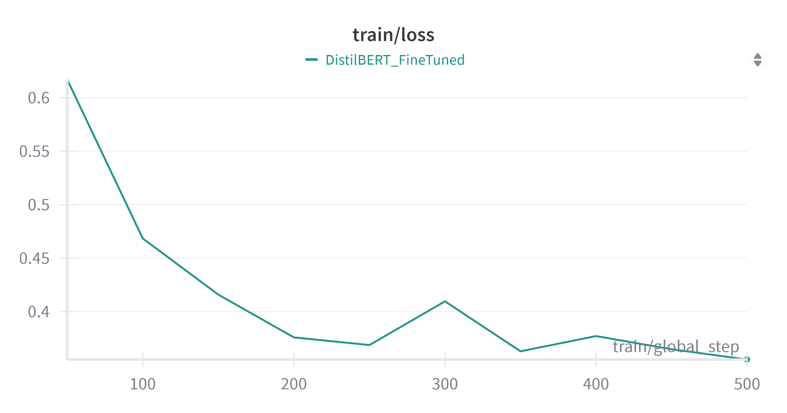
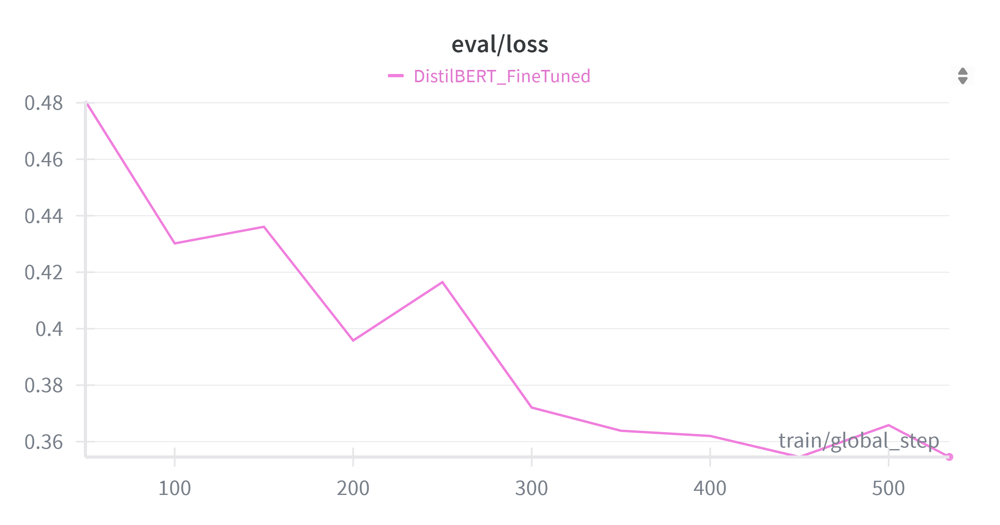
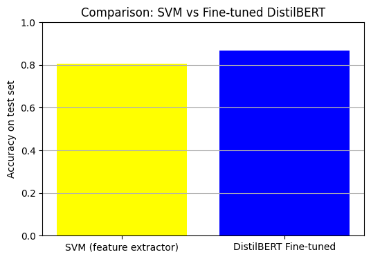

# **Working with Transformers in the HuggingFace Ecosystem - Laboratory 3**

## **Overview**

In this lab, I worked with the HuggingFace ecosystem to adapt a pre-trained transformer model to a new text classification task.  
The goal was to understand how the HuggingFace abstractions work and to build a reproducible pipeline, starting from dataset exploration and ending with full fine-tuning of the model.  
I first created a solid baseline using an SVM classifier on DistilBERT embeddings, and then compared it to a fine-tuned version of DistilBERT trained directly on the dataset.

## **Introduction**

Transformers are the backbone of most modern NLP models, but using them directly can be complex.  
HuggingFace makes the process much easier, allowing a smooth transition from feature extraction to fine-tuning with just a few lines of code. 
In this lab, the Rotten Tomatoes dataset was loaded and inspected to verify its structure.  
The dataset contains the following splits and sizes:

| Split       | Number of Examples | Labels       |
|------------:|-----------------:|-------------|
| Train       | 8530             | 0, 1        |
| Validation  | 1066             | 0, 1        |
| Test        | 1066             | 0, 1        | 

In this lab, I followed a progressive approach:  
1. Explore the Rotten Tomatoes dataset.  
2. Use DistilBERT as a pure feature extractor to train a simple classifier.  
3. Perform full fine-tuning of DistilBERT for sentiment analysis, comparing the results to the baseline.

## **Exercise 1  Sentiment Analysis**

I started by loading the dataset from HuggingFace and checking the train, validation, and test splits, along with the label distribution.  
I also inspected a few sample sentences to get familiar with the text style and content.

Next, I loaded the pre-trained DistilBERT model and tokenizer.  
I took a sample from the training set, tokenized it, and ran a forward pass to obtain the last hidden states.  
I verified the position of the *`[CLS]`* token, since this is where I would extract the embeddings for the SVM classifier.

I then implemented a function to extract `[CLS]` embeddings for all sentences in the three dataset splits.  
These embeddings were used to train a linear SVM on the training set, which I then evaluated on the validation and test sets.  
The results were solid for a non-fine-tuned model:  
**Validation accuracy** = **0.8189**  
Test accuracy = 0.8068

*This confirmed that even without task-specific training, transformer embeddings contain meaningful semantic information for classification.*

## **Exercise 2  Fine-tuning DistilBERT**

After establishing the baseline, the model was fine-tuned for the sentiment classification task.  
The tokenization step was applied to all splits with truncation and padding to a fixed length.  
DistilBERT was loaded with an added classification head for binary classification and all parameters were set to be trainable.
A training loop was implemented using HuggingFace’s `Trainer` API, with dynamic batch padding, evaluation during training, and model checkpointing based on the best validation accuracy.  
The evaluation metrics included accuracy, precision, recall, and F1 score.

The results will be added after training completion:

| Metric            | Value |
|-------------------|-------|
| Accuracy  | **0.8574**|
| Precision           | 0.8577 |
| Recall              |0.8574 |
| F1 score            |0.8574|
| Loss            | **0.3712** |
| *Training time*     | **81 min**|

Below will be added the plots showing the model’s learning progress over time:

| Training Loss | Evaluation Loss |
|:-------------:|:---------------:|
|  |  |

## Comparison with Baseline

The SVM baseline already showed strong performance thanks to the quality of DistilBERT embeddings.  
However, full fine-tuning of DistilBERT is expected to provide better results by adapting the model parameters directly to the Rotten Tomatoes dataset.  
This experiment demonstrates the flexibility of the HuggingFace ecosystem to move from simple feature extraction to complete fine-tuning with minimal changes in workflow.

## **Exercise 3.1  Efficient Fine-tuning with PEFT (LoRA)**

In this exercise, I explored ways to make fine-tuning DistilBERT more efficient for sentiment analysis on the Rotten Tomatoes dataset. In the previous exercise, I had fine-tuned the entire model, which proved to be quite expensive in terms of computation. Here, I focused on **parameter-efficient fine-tuning** using the HuggingFace **PEFT library**, specifically implementing **LoRA (Low-Rank Adaptation)**.

The main idea was to adapt only a small subset of the model’s weights, namely the query and value projection layers (`q_lin` and `v_lin`), while keeping the rest of the parameters frozen. This approach reduces the number of trainable parameters and the memory footprint, without changing the main training pipeline. Mixed-precision training was also used to further optimize GPU memory usage.

After three epochs of training, the LoRA-adapted model achieved the following results on the validation set:

| Metric       | LoRA  | Full Fine-tuning |
|--------------|-------|------------------|
| Eval loss    | 0.4289 | 0.3712 |
| Accuracy     | 0.8527 | 0.8574 |
| Precision    | 0.8531 | 0.8577 |
| Recall       | 0.8527 | 0.8574 |
| F1 score     | 0.8527 | 0.8574 |
|Training time | **170 min**| **81 min** |

Despite reducing the number of trainable parameters, LoRA required **2 hours and 50 minutes** for three epochs, compared to **1 hour and 21 minutes** for full fine-tuning. This may seem counterintuitive, but it can happen for several reasons:
- LoRA adds additional adapter layers, which introduce extra forward and backward computations per batch.
- The underlying frozen model parameters still need to be loaded and processed at every step, so total computation is not reduced proportionally to the number of trainable parameters.
- With smaller datasets like Rotten Tomatoes, the main training bottleneck may not be parameter updates but rather the model’s forward pass and data loading, which LoRA does not accelerate.

This suggests that for small datasets, the main benefits of LoRA may not be visible in terms of training time. Instead, they may become evident in **lower GPU memory usage** and the ability to fine-tune much larger models without exceeding hardware limits. In those scenarios, the slight overhead in computation time may be a reasonable trade-off for being able to train models that would otherwise be infeasible.

