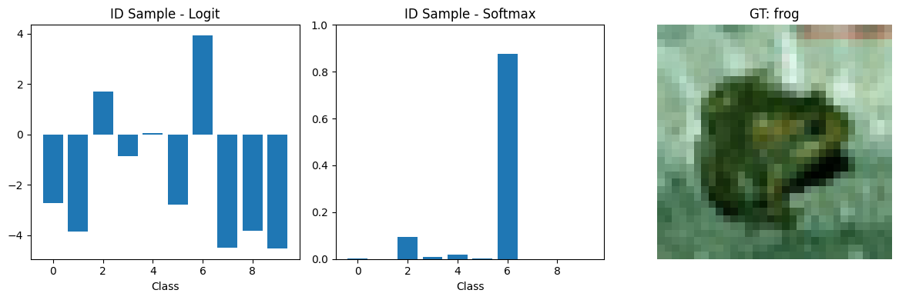

# **Adversarial Learning - Laboratory 4**

## **Overview**
In this laboratory, we explored the concept of adversarial attacks in deep learning, focusing on the **Fast Gradient Sign Method (FGSM)**. Both **untargeted** and **targeted** attacks were implemented to investigate the vulnerabilities of a convolutional neural network trained on CIFAR-10. The goal of the experiments was twofold: first, to assess how small perturbations in the input images can significantly affect model predictions; second, to analyze how adversarial examples can be used to improve model robustness through adversarial training.

---

## **Training Pipeline and Infrastructure**
A modular training framework in PyTorch was set up to support both clean and adversarial evaluation. The pipeline was designed to be flexible and reproducible, including automatic GPU detection and seamless loading of pre-trained models.  
Integration with *Weights & Biases* enabled real-time monitoring of training and evaluation metrics, providing clear visualization of:
- Loss curves for clean and adversarial inputs
- Accuracy trends under different attack strengths and modes
- Comparisons across multiple experiments to quantify model vulnerability  

The attack configuration was parameterized, allowing the adjustment of factors such as `epsilon` (perturbation magnitude) and the choice of target class in targeted attacks, ensuring a versatile setup for systematic experimentation.

---

## **Key Components and Methodology**

### **Model Setup**
The core model for this laboratory was a **Residual CNN (ResCNN)**. We used a checkpoint (`best_model_ResCNN.pth`) obtained from a previous exercise (*Exercise 1*), leveraging a pre-trained, high-performing network as a starting point. This approach allowed us to focus on evaluating adversarial effects without retraining from scratch. Standard CIFAR-10 preprocessing, normalization, and data augmentation techniques were applied to ensure consistent input quality.

### **FGSM Attack Implementation**
We implemented a **single, unified FGSM function** that could operate in both untargeted and targeted modes. In untargeted attacks, the perturbations are crafted to maximize the model’s prediction error, while in targeted attacks, they are directed toward a specific class. By using this unified approach, we maintained modularity and reusability in the code, simplifying experimentation across different scenarios.

### **Experiments**
The first set of experiments focused on **untargeted FGSM attacks** with moderate epsilon values (0.03). The perturbed images showed minimal visible differences compared to the original images, yet they were sufficient to induce a substantial number of misclassifications. This clearly demonstrated the fragility of neural networks to carefully constructed adversarial perturbations. 

Subsequent experiments explored **targeted attacks**, analyzing how the model could be manipulated toward a desired class with minimal input modifications. Throughout the experiments, performance metrics and visualizations were logged to WandB, enabling a quantitative and qualitative assessment of attack effectiveness.

---

## **Exercise 1: OOD Detection and Performance Evaluation**

### **Exercise 1.1 — Building a Simple OOD Detection Pipeline**
In this exercise, a simple OOD detection pipeline was implemented to evaluate how well a pre-trained Residual CNN could differentiate between in-distribution (ID) and out-of-distribution (OOD) samples. CIFAR-10 was used as the ID dataset, while a synthetic dataset generated via FakeData served as OOD samples. The method used **maximum softmax probability** as a confidence score to quantify how “in-distribution” a sample appeared to the model.

The pipeline involved:
1. Evaluating the model on the ID test set to compute standard classification metrics such as **accuracy** and the **normalized confusion matrix**  
2. Selecting random samples from both ID and OOD datasets to visualize:  
   - The original input image  
   - The raw logits output by the model  
   - The corresponding softmax probabilities  

This qualitative visualization allowed us to see that ID samples generally produced high confidence scores for the correct class, while OOD samples yielded lower confidence, indicating uncertainty.

3. Plotting histograms of maximum softmax probabilities for both ID and OOD datasets to assess how well the scoring function separates the two distributions.

### **Results**
**ID Classification Performance**
| Metric   | Value  |
|---------|--------|
| Accuracy | 0.7705 |

**Normalized Confusion Matrix (ID Test Set)**  

**Max Softmax Probability Distributions**
| ID Sample | OOD Sample |
|:---------:|:----------:|
|  |  |

---

## **Exercise 1.2 — Measuring OOD Detection Performance**
In this exercise, the Out-of-Distribution (OOD) detection pipeline was extended by introducing **quantitative performance evaluation metrics**. The primary focus was on threshold-free evaluation methods, which avoid depending on a single decision threshold. Specifically, two widely used metrics were computed:

1. **Area Under the Receiver Operating Characteristic Curve (AUROC)** — measures the trade-off between the true positive rate and the false positive rate for OOD detection, considering all possible thresholds  
2. **Area Under the Precision–Recall Curve (AUPR)** — captures the balance between precision and recall for both ID and OOD detection scenarios, particularly informative for imbalanced datasets  

The **Maximum Softmax Probability (MSP)** scores obtained from the previous exercise were used as the detection scores for both ID and OOD samples. Histograms of MSP values were first plotted to visually assess separation between the two distributions. The degree of **distribution overlap** was also calculated, providing a direct measure of how much the two score distributions intersect.

### **Results**
**Histogram of MSP Scores**  

**Distribution Overlap**  
| Metric | Value |
|--------|-------|
| Overlap Area | 0.4758 |

**ROC and Precision–Recall Curves**  

---

## **Exercise 2.1 — Implementing FGSM and Generating Adversarial Examples**
The Fast Gradient Sign Method (FGSM) was implemented to generate adversarial examples starting from correctly classified images of the CIFAR-10 test set. The attack perturbs each input image in the direction of the gradient of the loss with respect to the input pixels, scaled by a perturbation magnitude parameter $\varepsilon$. This modification aims to push the model toward making incorrect predictions while keeping the perturbation imperceptible to the human eye.

For this experiment, only the **untargeted attack** mode of the FGSM function was used — perturbations were crafted solely to increase the loss of the correct class, without forcing the model toward a specific alternative class.

### **Results**
**Example of Untargeted FGSM Attack ($\varepsilon = 0.03$)**  

---

## **Exercise 2.2 — Augment Training with Adversarial Examples**
In this part, the **FGSM** function (in *untargeted* mode) was used to generate adversarial examples ***on-the-fly*** during training, to increase the model’s robustness.  
For each batch, the model was first trained on original images and then on perturbed versions of the same images.

| Configuration | Value |
|---------------|-------|
| Epochs | 40 |
| Epsilon | 0.03 |
| Learning Rate | 1e-3 |
| Batch size | 128 |

### **Final Results**
**Performance on original images**  
| Dataset | Accuracy | F1-score |
|---------|----------|----------|
| Train   | 0.8484   | 0.8463   |
| Test    | 0.7915   | 0.7887   |

**Performance on adversarial images (FGSM)**  
| Dataset | Accuracy | F1-score |
|---------|----------|----------|
| Train   | 0.6506   | 0.6455   |
| Test    | 0.5995   | 0.5954   |

**Observations**  
- The model retains good performance on clean/original images but shows significant robustness improvement compared to the non-adversarially trained version when tested with perturbed inputs  
- There is still a performance gap between original and adversarial data, indicating that training mitigates but does not completely eliminate vulnerability  
- *On-the-fly adversarial training* increases training time, since each batch requires an extra forward + backward pass to generate and learn from adversarial examples  

**Loss curves**  
| Training Loss on original images | Training Loss on adversarial images |
|:-------------------------------:|:---------------------------------:|
|  |  |

---

## **Exercise 3.3 — Targeted Adversarial Attacks (FGSM)**
A **targeted** variant of FGSM was implemented to steer predictions toward a specific class on the non-improved model. Starting from correctly classified CIFAR-10 test images (misclassified samples were skipped), perturbations with $\varepsilon = 0.03$ were crafted. Both **single-image** success and **batch-level** behavior were evaluated. Although FGSM is a single-step method, a short iterative loop (up to 5 steps) was used to see how quickly the model could be pushed to the desired class.

**Single-image attack (target = “horse”)** reached the target in **3 steps** with minimal visible change.  
A batch study (target = “bird”) was performed over multiple samples, measuring success rate, confidence shift toward the target class, and L2 magnitude of perturbations.

| Setting | Value |
|---------|-------|
| Epsilon | 0.03 |
| Target classes | `horse` (single example), `bird` (batch run) |
| Iteration budget | ≤ 5 FGSM steps (targeted) |
| Selection policy | Only images **correctly classified** at start |

### **Quantitative Results (batch experiment, target = “bird”)**
| Metric | Value |
|--------|-------|
| Targeted success rate | 61.39% |
| Avg. confidence ↑ for target class | 0.4077 |
| Avg. perturbation ‖δ‖₂ | 1.6628 |

**Notes.**  
Success rate is computed over the subset of images correctly classified before the attack. Confidence increase is measured as the post-attack softmax probability for the target class minus the pre-attack probability. Perturbation magnitude is the L2 norm between adversarial and original images.

### **Qualitative Examples**
**Single image (target = “horse”)**  

**Mini-grid (target = “bird”)**  
  

> **Note:** I also tested the targeted attack on the **on-the-fly trained model**. This model proved significantly harder to attack — in many cases, the attack either failed due to exceeding the maximum step limit, or succeeded only after roughly ten iterations. Although these results are not reported in detail here, the experiment was performed.
